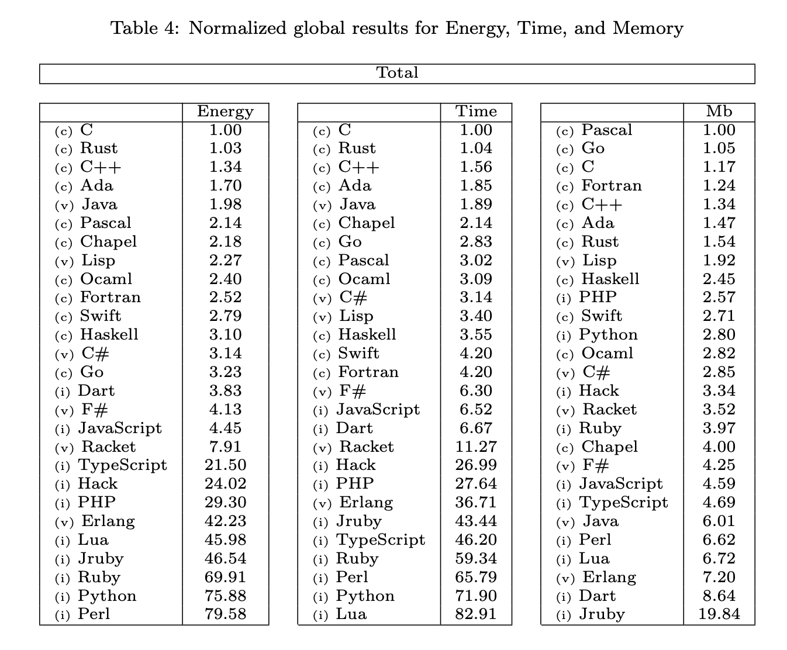

## Computers and energy

Computers are general-purpose hardware - therefore they are NOT the most efficient way to proccess things. By definition, use FPGAs or building a specific hardware for some operation would deffinetly be more efficient than using any programming language to run inside a CPU.

## How to measure how much energy a programming language consumes?

Well, in the attempt to measure it, researchers from the *Universidade do Minho* wrote this <a target="_blank" rel="noopener" href="https://repositorium.sdum.uminho.pt/bitstream/1822/69044/1/paper.pdf">article</a>. 

To summarize it, they basically run lot's of different algorithms in various programming language. And of course, I really encourage you to read the <a target="_blank" rel="noopener" href="https://repositorium.sdum.uminho.pt/bitstream/1822/69044/1/paper.pdf">article</a> and see the actual methodology.

Here is what they found:

I saw a lot of people talking about this - awesome - research, which is pretty cool. But they were using it to show that some programming languages are greener than others, which is just wrong.

1. We can always change compilers and runtimes to be more efficient, so the language itself can be isolated. OK, that's just me being pedant.

2. Is the faster one also the most efficient? Well...  *Energy = Time x Power*. By this equation we can see that the energy would decrease if time decreses, right? No quite, because we can't assure that the *Power* would be constant. In fact, C is pointed out as the most efficient language in this article, but often it is not the faster one. 

3. Hardware. The results may vary depending on the hardware we're using, or OS, or middlewares, drivers and etc... It's really tricky to point out a grenner language because the language is not the entire package we're going to be using. 
What is the environmental impact of using C for all applications we know? It could be huge, it's really hard to say.

4. Erlang uses parallelism all the time, and on purpose. That's the way this languaguage/runtime found out to be more resilient and pratical for telecom applications at the 80s. So let's assume Erlang and C are optimized at their best. If we do the same resilient applications with C, would we have the same results...

We can choose our programming language based on this paper, but we should always be careful to not reinvent the wheel every time. The paper is pretty complex and well written to be summarized in *"let's use C because it is the more efficient one!!!!"*. So maybe we shouldn't be doing that.

---

Talk soon, 

Victor Fulgêncio.

